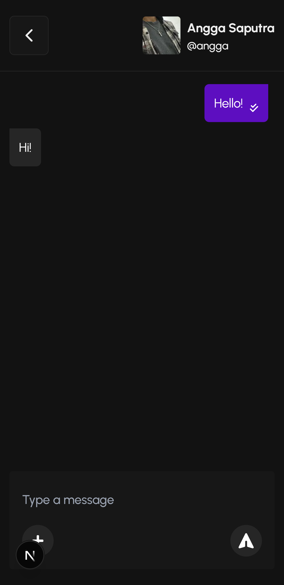
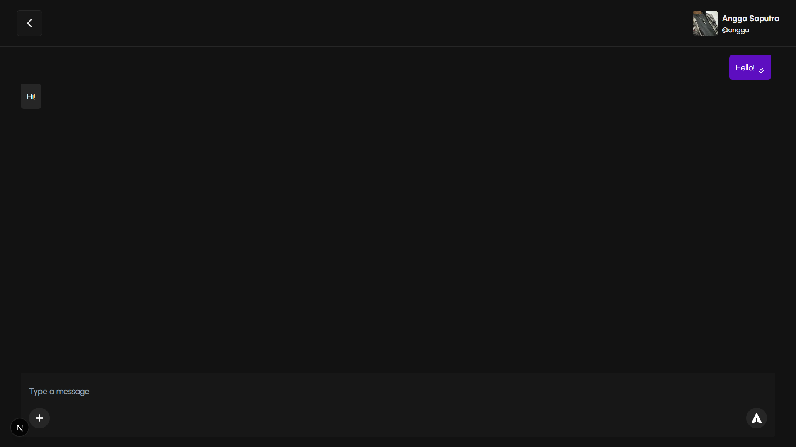

# 💬 SupaChat – Real-Time Chat App with Supabase

SupaChat is a responsive and modern **real-time chat application** inspired by **WhatsApp**. Built with **Next.js**, **Tailwind CSS**, and **Supabase**, it enables users to **send and receive messages instantly** in a clean, user-friendly interface.

---

## 🚀 Features

- 💬 Real-time 1-on-1 messaging using Supabase Realtime
- 🧑 User authentication (sign up, login, logout)
- ✅ Message read/unread indicators
- 📱 Fully responsive layout (mobile, tablet, desktop)
- ⏱️ Optimistic UI & loading states for better UX

---

## 🛠️ Tech Stack

- **Frontend**: Next.js + Tailwind CSS
- **Backend**: Supabase (Database + Auth + Realtime)
- **Database**: PostgreSQL (hosted by Supabase)
- **Authentication**: Supabase Auth (Email + Password or OAuth)
- **Deployment**: Vercel

---

## 📦 Installation

```bash
# Clone the repository
git clone https://github.com/anggasaputra25/supachat.git
cd supachat

# Install dependencies
npm install

# Run the app locally
npm run dev
```

---

## 🌐 Environment Variables

Create a `.env.local` file in the root directory:

```
NEXT_PUBLIC_SUPABASE_URL=https://your-project-id.supabase.co
NEXT_PUBLIC_SUPABASE_KEY=your-key
```

Get your API keys at [Supabase Project Settings](https://supabase.com/)

---

## 📸 Screenshots

> Mobile & Desktop View:

| Mobile View | Desktop View |
|-------------|--------------|
|  |  |

---

## 📁 Folder Structure

```
supachat/
├── app/                # Next.js App Router pages & layouts
├── components/         # UI Components (ChatWindow, MessageInput, etc.)
├── lib/                # Supabase client & helpers
├── types/              # TypeScript interfaces
├── public/             # Static files and images
├── .env.local          # Your environment variables
└── ...
```

---

## 🔒 Notes & Limitations

- Supabase free tier has limitations on Realtime connections and Auth
- Currently supports only 1-on-1 chat (group chat coming soon)
- No file/image upload yet (planned)

---

## 📌 To-Do / Improvements

- 👥 Group chat functionality
- 🖼️ Image/file sharing
- 🟢 Online presence indicators
- 🔆 Light mode

---

## 🙌 Credits

- [Supabase](https://supabase.com/)
- [Next.js](https://nextjs.org/)
- [Tailwind CSS](https://tailwindcss.com/)
- Made with ❤️ by Angga
- ☕️ Like this project? Feel free to [buy me a coffee](https://lynk.id/payme/justangga)!

---

## 📄 License

This project is licensed under the MIT License.